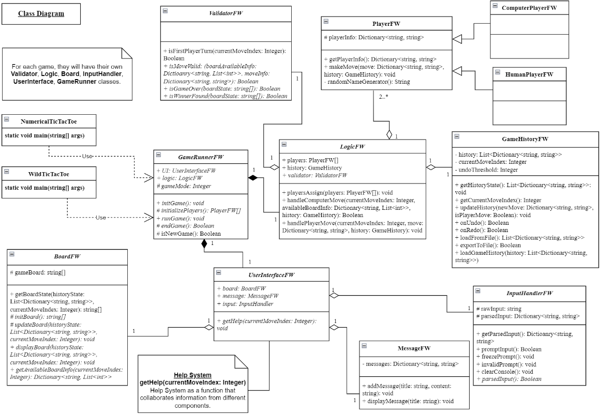

## Holistic Software System Design: UML Design to Projects

Using Board Game as an example of **implementation**.

### Demo: Game Design Manual 

- Explore the **Game Design Manual PDF** (`Game_Design_Manual.pdf`) for a detailed guide and the blueprints of the entire design.
  - [Comprehensive Game Design & Usage Manual](https://github.com/andrewtclin/board-game-framework-with-num-tic-tac-toe/blob/master/Game_Design_Manual.pdf)
- To run the application, execute `dotnet run` in the project folder to run **Game Demo**.

### Overview

- This Board Game Framework is a comprehensive and well-designed C# .NET project that provides a versatile foundation for developing different board games.
- A robust structure and design, making it easy to implement on different games using this framework.
- One example implementation of the framework is the **Numerical Tic Tac Toe game**, accompanied by a well-crafted and structured user manual in PDF format

### Features

- Extensive board game framework designed to support multiple games.
- Implementation of Numerical Tic Tac Toe using the framework.
- User-friendly and informative Game Design Manual PDF provided for a comprehensive understanding of the game.

### Game Design Manual

- For detailed understanding of the Numerical Tic Tac Toe game and its implementation using the Board Game Framework, refer to the **Game Design Manual PDF**.
- The manual is thoughtfully structured and provides **detailed explanations**, **blueprints**, and **guidelines** to enhance your gaming experience.
